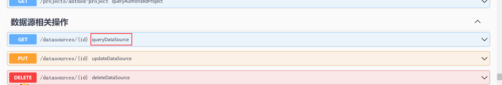

# swagger-api-proxy 使用介绍

## 1. 什么是 swagger-api-proxy, 它有什么作用？
swagger-api-proxy是对规范的swagger-api文档解析生成restapi访问工具，主要用于自动化测试和接口自动化。<br>
1.无视 get、 post、put......<br>
2.支持表单，raw,动态路由格式参数 上传文件<br>
3.支持异步请求<br>
4.支持参数任意格式<br>
5.支持自定义返回类型<br>
6.环境隔离<br>

## 2. 使用方式

### 2.1 pom引用
```angular2html

<dependency>
    <groupId>com.yzm.project</groupId>
    <artifactId>swagger-api-proxy</artifactId>
    <version>1.0.0</version>
</dependency>

```
2.2 使用demo

```angular2html
/**
 * Test2
 * @description ${description}
 * @author yzm
 * @date 2024/5/20 9:41
 * @version 1.0
 */

class LocalEnvInit {
    static init() {
        //1.注册swagger环境
        Environment environment = new Environment(name: "dolphin", urlOrFilePath: "http://192.168.110.252:12345/dolphinscheduler/v3/api-docs/v1", env: Env.Http)
        Environment.register(environment)
        //2.设置当前使用的api环境
        Environment.currentApplication.set("dolphin")
        //3.设置token
        CurrentHeader currentHeader = new CurrentHeader()
        currentHeader.token = "02d3350053cabcf3b6e353549e0bf971"
        currentHeader."Content-Type" = "application/json"
        CurrentHeader.set(currentHeader)
    }

    static init(String path) {
        //1.注册swagger环境
        Environment environment = new Environment(name: "dolphin", urlOrFilePath: path, env: Env.LocalFile)
        Environment.register(environment)
        //2.设置当前使用的api环境
        Environment.currentApplication.set("dolphin")
        //3.设置token
        CurrentHeader currentHeader = new CurrentHeader()
        currentHeader.token = "3a267ccbb9b096e2ec29a90eeaed03c3"
        currentHeader."Content-Type" = "application/json"
        CurrentHeader.set(currentHeader)
    }
}


class 资源管理 {


    //1.上传文件
    @org.junit.Test
    void upload() {
        LocalEnvInit.init()
        //4.查询上传文件方法
        def server = new ApiServer("queryTenantListPaging")
        def method = server.searchMethod("/resources")
        println method
        server = new ApiServer("createResource")
        def res = server.get(true, [
                file      : new FileInputStream(new File("C:\\Users\\SKZZ\\Desktop\\新建 文本文档 (2).txt")),
                type      : "FILE",
                name      : "新建 文本文档 (2).txt",
                currentDir: "/"
        ], Map.class)
        println "=================================================================="
        assert res?.code == 0: "上传文件失败"
        println res
    }

    //2.更新文件
    @org.junit.Test
    void updateFile() {
        //1.初始化环境
        LocalEnvInit.init()
        //2.更新文件方法
        def server = new ApiServer("updateResource")
    }

    //3.删除文件
    @org.junit.Test
    void deleteFile() {
        //1.初始化环境
        LocalEnvInit.init()
        //2.删除文件方法
        def server = new ApiServer("deleteResource")
    }


    //4.文件列表
    @org.junit.Test
    void listFile() {
        //1.初始化环境
        LocalEnvInit.init()
        //2.获取文件列表方法
        def server = new ApiServer("queryResourceListPaging")
    }

    //5.下载文件
    @org.junit.Test
    void download() {
        //1.初始化环境
        LocalEnvInit.init()
        //2.下载文件方法
        def server = new ApiServer("downloadResource")

        def res = server.download(["fullName": "hdfs://cloud1:8020/dolphinscheduler/tenant_001/resources/新建 文本文档 (2).txt"])
        def file = new File("C:\\Users\\SKZZ\\Desktop\\新建 文本文档 (3).txt")
        file.createNewFile()
        FileOutputStream fos = new FileOutputStream(file)
        //TODO 这里有坑，请自行优化
        fos.write(res.getBytes())
        fos.close()
        res.close()

    }
}

class 项目管理 {
    //1.查询项目列表
    @org.junit.Test
    void listProject() {
        //1.初始化环境
        LocalEnvInit.init()
        //2.获取项目的操作方法
        def server = new ApiServer("projects")
        def method = server.searchMethod("/projects")
        println method
        server = new ApiServer("queryProjectListPaging")
        def res = server.get([pageNo: 1, pageSize: 10], Map.class)
        println "=================================================================="
        assert res?.code == 0: "获取项目列表失败"
        println res
    }

    //2.创建项目
    @org.junit.Test
    void createProject() {
        //1.初始化环境
        LocalEnvInit.init()
        //2.创建项目的操作方法
        def server = new ApiServer("create_1")
        def res = server.get(true, [
                projectName: "projcet_004",
                description: "project_004",
                userName   : "user_002",
        ], Map.class)
        println "=================================================================="
        assert res?.code == 0: "创建项目失败"
        println res
    }

    //删除项目
    @org.junit.Test
    void deleteProject() {
        //1.初始化环境
        LocalEnvInit.init()
        //2.删除项目的操作方法
        def server = new ApiServer("delete")
        def method = server.searchMethod("/projects/{code}")
        println method
        def res = server.get([
                code: "13664281407680"
        ], Map.class)
        println "=================================================================="
        assert res?.code == 0: "删除项目失败"
        println res
    }


    //3.修改项目
    @org.junit.Test
    void updateProject() {
        //1.初始化环境
        LocalEnvInit.init()
        //2.修改项目的操作方法
        def server = new ApiServer("update_2")
        def res = server.get(true, [
                code       : "13664305628864",
                projectName: "projcet_004",
                description: "project_004",
                userName   : "user_002",
        ], Map.class)
        println "=================================================================="
        assert res?.code == 0: "修改项目失败"
        println res
    }


    //获取项目详情
    @org.junit.Test
    void getProject() {
        //1.初始化环境
        LocalEnvInit.init()
        //2.获取项目的操作方法
        def server = new ApiServer("queryProjectByCode")
        def res = server.get([code: "13664305628864"], Map.class)
        println "=================================================================="
        assert res?.code == 0: "获取项目详情失败"
        println res
    }

}

class 工作流管理 {


    //1.查询工作流列表
    @org.junit.Test
    void listWorkflow() {
        //1.初始化环境
        LocalEnvInit.init()
        //2.获取工作流的操作方法
        def server = new ApiServer("queryListPaging")
        def method = server.searchMethod("/projects/{projectCode}/process-definition")
        println method
        /**
         * queryListPaging
         * createProcessDefinition
         */
        def res = server.get([projectCode: "13610097827648", pageNo: 1, pageSize: 10], Map.class)
        println "=================================================================="
        assert res?.code == 0: "获取工作流列表失败"
        println res
    }

    //2.创建工作流
    @org.junit.Test
    void createWorkflow() {
        //1.初始化环境
        LocalEnvInit.init()
        //2.创建工作流的操作方法
        def server = new ApiServer("createProcessDefinition")
        def res = server.get(true, [
                projectCode       : "13610097827648",
                taskDefinitionJson: [["code": 13664597736769, "delayTime": "0", "description": "asdffd", "environmentCode": 13552789196512, "failRetryInterval": "1", "failRetryTimes": "0", "flag": "YES", "isCache": "NO", "name": "cc_01", "taskParams": ["localParams": [["prop": "cc", "direct": "IN", "type": "VARCHAR", "value": "111"]], "rawScript": "echo 111", "resourceList": []], "taskPriority": "MEDIUM", "taskType": "SHELL", "timeout": 0, "timeoutFlag": "CLOSE", "timeoutNotifyStrategy": "", "workerGroup": "default", "cpuQuota": -1, "memoryMax": -1, "taskExecuteType": "BATCH"]],
                taskRelationJson  : [["name": "", "preTaskCode": 0, "preTaskVersion": 0, "postTaskCode": 13664597736769, "postTaskVersion": 0, "conditionType": "NONE", "conditionParams": []]],
                locations         : [["taskCode": 13664597736769, "x": 256.5714111328125, "y": 58.71427917480469]],
                name              : "test_006",
                executionType     : "PARALLEL",
                description       : "test_006",
                globalParams      : [
                        [
                                "prop": "cc", "value": "ccc", "direct": "IN", "type": "VARCHAR"
                        ]
                ],
                timeout           : 0
        ], Map.class)
        println "=================================================================="
        assert res?.code == 0: "创建工作流失败"
        println res
    }

    //3.删除工作流
    @org.junit.Test
    void deleteByCode() {
        //1.初始化环境
        LocalEnvInit.init()
        //2.删除工作流的操作方法
        def server = new ApiServer("deleteByCode")
        def method = server.searchMethod("/projects/{projectCode}/process-definition/{code}")
        /**
         * deleteByCode
         * update_1
         * queryProcessDefinitionByCode
         */
//        println method
        def res = server.get([
                projectCode: "13610097827648",
                code       : "13665451117120"
        ], Map.class)
        println "=================================================================="
        assert res?.code == 0: "删除工作流失败"
        println res
    }

    //4. 更新工作流
    @org.junit.Test
    void update_1() {
        //1.初始化环境
        LocalEnvInit.init()
        //2.更新工作流
        def server = new ApiServer("update_1")
        def res = server.get(true, [
                projectCode       : 13665565747008,
                taskDefinitionJson: [["code": 13664597736769, "delayTime": "0", "description": "asdffd", "environmentCode": 13552789196512, "failRetryInterval": "1", "failRetryTimes": "0", "flag": "YES", "isCache": "NO", "name": "cc_01", "taskParams": ["localParams": [["prop": "cc", "direct": "IN", "type": "VARCHAR", "value": "111"]], "rawScript": "echo 111", "resourceList": []], "taskPriority": "MEDIUM", "taskType": "SHELL", "timeout": 0, "timeoutFlag": "CLOSE", "timeoutNotifyStrategy": "", "workerGroup": "default", "cpuQuota": -1, "memoryMax": -1, "taskExecuteType": "BATCH"]],
                taskRelationJson  : [["name": "", "preTaskCode": 0, "preTaskVersion": 0, "postTaskCode": 13664597736769, "postTaskVersion": 0, "conditionType": "NONE", "conditionParams": []]],
                locations         : [["taskCode": 13664597736769, "x": 256.5714111328125, "y": 58.71427917480469]],
                name              : "test_006",
                executionType     : "PARALLEL",
                description       : "test_006",
                globalParams      : [
                        ["prop": "cc", "value": "ccc", "direct": "IN", "type": "VARCHAR"],
                        ["prop": "cc2", "value": "ccc1", "direct": "IN", "type": "VARCHAR"]
                ],
                timeout           : 0,
                releaseState      : "OFFLINE"
        ], Map.class)
        println "=================================================================="
        assert res?.code == 0: "更新工作流失败"
        println res
    }

    //5.查询工作流详情
    @org.junit.Test
    void queryProcessDefinitionByCode() {
        //1.初始化环境
        LocalEnvInit.init()
        //2.查询工作流详情
        def server = new ApiServer("queryProcessDefinitionByCode")
        def res = server.get([
                projectCode: 13696795073888,
                code       : 13697663276512
        ], Map.class)
        println "=================================================================="
        assert res?.code == 0: "查询工作流详情失败"
        println res
    }

    //6.工作流上线
    @org.junit.Test
    void online() {
        //1.初始化环境
        LocalEnvInit.init()
        //2.查询工作流详情
        def server = new ApiServer("release")
        def res = server.get(true, [
                projectCode : 13696795073888,
                code        : 13697663276512,
                name        : "java_test",
                releaseState: "ONLINE"
        ], Map.class)
        println "=================================================================="
        assert res?.code == 0: res?.msg
        println res
    }

    //7.运行工作流
    //TODO 验证
    @org.junit.Test
    void start() {
        //1.初始化环境
        LocalEnvInit.init()
        //2.运行工作流
        def server = new ApiServer("startProcessInstance")
        def res = server.get(true, [
                projectCode            : 13696795073888,
                processDefinitionCode  : 13697663276512,
                failureStrategy        : "CONTINUE",
                warningType            : "NONE",
                execType               : "START_PROCESS",
                taskDependType         : "TASK_POST",
                complementDependentMode: "OFF_MODE",
                runMode                : "RUN_MODE_SERIAL",
                processInstancePriority: "MEDIUM",
                workerGroup            : "default",
                tenantCode             : "default",
                dryRun                 : 0,
                testFlag               : 0,
                version                : 2,
                allLevelDependent      : "false",
                executionOrder         : "DESC_ORDER",
                scheduleTime           : ["complementStartDate": "2024-05-29 00:00:00", "complementEndDate": "2024-05-29 00:00:00"]


        ], Map.class)
        println "=================================================================="
        assert res?.code == 0: res?.msg
        println res

        
    }

}
```
提示： new ApiServer("xxx") 的xxx对应下图红框：

重名时的后缀会自动+1 如xxx_1 、xxx_2

## 3.未来计划
暂时没有没有时间优化，欢迎补充


